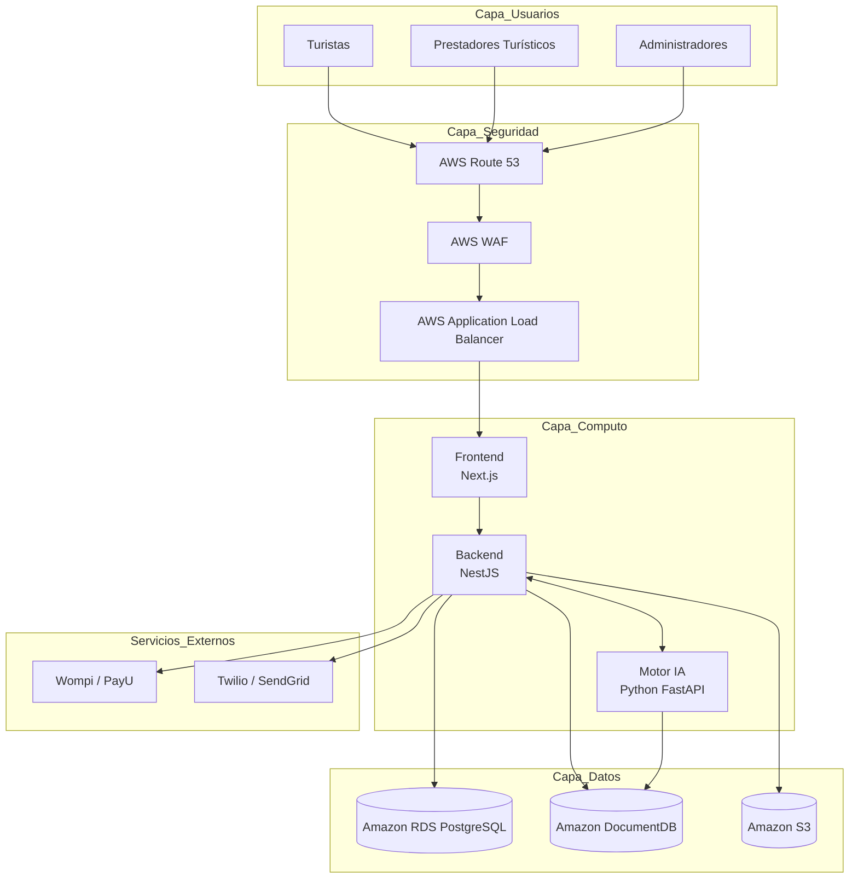
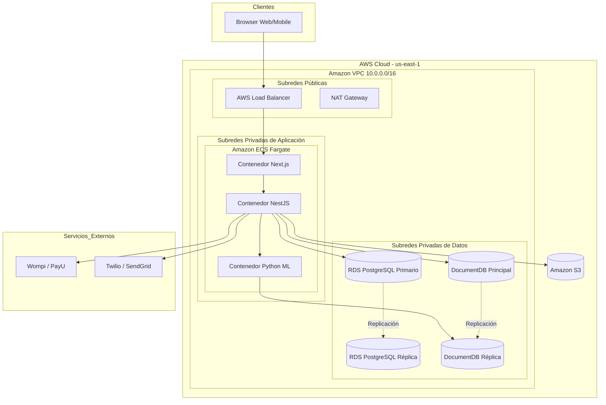

# Informe de Ingeniería: Arquitectura de Sistemas de Información y Arquitectura Tecnológica

## Caso de Estudio
**Ecosistema Digital de Intermediación Turística – Sucre Conecta Digital S.A.S.**

**Asignatura:** Arquitectura Empresarial  
**Integrantes:** Jesús Villalba, Steven Tete, Jesús Madera, Cristian Brieva

---

# 1. Introducción y Sustento Estratégico

El presente documento constituye el informe técnico consolidado del diseño de la **Arquitectura de Sistemas de Información (ASI)** y la **Arquitectura Tecnológica (AT)** para la organización **Sucre Conecta Digital S.A.S.**

El objetivo fundamental de esta fase es materializar las definiciones de negocio previamente estructuradas (Modelo Operativo de 4 Fases y Capacidades Críticas de Gestión de Proveedores, Analítica y Calidad) en una infraestructura tecnológica física y lógica de nivel empresarial.

Para ello, se adopta un enfoque basado en computación en la nube bajo el modelo de **Arquitectura Limpia (Clean Architecture)** y **Microservicios Desacoplados**, garantizando que el ecosistema digital sea altamente disponible, seguro, elástico y tolerante a fallos, preparado para mitigar la informalidad y la fragmentación del sector turístico en el departamento de Sucre.

---

# 2. Entregable A: Catálogo Tecnológico Exhaustivo

Este catálogo identifica, clasifica y justifica cada componente de hardware, software e infraestructura cloud requeridos para soportar las operaciones del ecosistema digital.

| Componente | Función | Tecnología Seleccionada | Justificación |
|-------------|---------|-------------------------|---------------|
| **Portal de Experiencia del Cliente (Frontend)** | Interfaz para turistas y prestadores | **Next.js (React 18) + TailwindCSS + TypeScript** | Optimización SEO mediante SSG y SSR. |
| **Servidor de Aplicación Core (Backend API)** | Lógica de negocio y procesamiento de reservas | **Node.js (NestJS) + TypeScript** | Arquitectura modular y procesamiento asíncrono eficiente. |
| **Motor Analítico y de Recomendación (IA Engine)** | Modelos de Machine Learning y predicción | **Python 3.11 + FastAPI + Scikit-Learn** | Alto rendimiento y estándar para ciencia de datos. |
| **Base de Datos Transaccional** | Persistencia de datos críticos | **Amazon RDS PostgreSQL 16 (Multi-AZ)** | Cumplimiento ACID y alta disponibilidad. |
| **Base de Datos Documental** | Catálogos y datos flexibles | **Amazon DocumentDB (MongoDB)** | Esquema flexible basado en JSON. |
| **Repositorio de Objetos** | Almacenamiento de documentos y multimedia | **Amazon S3** | Durabilidad del 99.999999999 %. |
| **Firewall Web** | Protección frente a ataques | **AWS WAF** | Mitigación de amenazas OWASP Top 10. |
| **Balanceador de Carga** | Distribución de tráfico | **AWS Application Load Balancer** | Enrutamiento inteligente y Health Checks. |
| **Pasarela de Pagos** | Procesamiento de pagos | **Wompi API / PayU SDK** | Cumplimiento PCI-DSS. |
| **Gateway de Mensajería** | Notificaciones y alertas | **Twilio API y SendGrid API** | Alta disponibilidad y entregabilidad. |

---

# 3. Entregable B: Diagrama Tecnológico de Flujo de Datos

---

# 4. Entregable C: Diagrama de Despliegue de Infraestructura Cloud (AWS)

---

# 5. Entregable D: Justificación de las Decisiones Tecnológicas

## 1. Elasticidad frente a la Estacionalidad

La demanda turística presenta variaciones importantes según las temporadas vacacionales y festividades.

La utilización de **Amazon ECS con AWS Fargate** permite una infraestructura serverless capaz de escalar automáticamente según la carga del sistema, optimizando costos y garantizando disponibilidad.

---

## 2. Persistencia Políglota

El sistema maneja dos tipos de datos:

### Datos transaccionales
- Reservas.
- Pagos.
- Comisiones.

Se emplea **Amazon RDS PostgreSQL**, garantizando propiedades ACID.

### Datos de catálogo

- Prestadores turísticos.
- Servicios.
- Características variables.

Se utiliza **Amazon DocumentDB**, permitiendo esquemas flexibles basados en JSON.

---

## 3. Desacoplamiento Analítico

El motor de Inteligencia Artificial se despliega como un microservicio independiente:

- **Backend principal:** NestJS.
- **Motor analítico:** Python + FastAPI.

Esto evita que las cargas de Machine Learning afecten los procesos críticos de reserva y pagos.

---

## 4. Seguridad y Aislamiento

La arquitectura sigue el principio **Security by Design**:

- AWS WAF como capa perimetral.
- Application Load Balancer como punto de entrada.
- Bases de datos en subredes privadas.
- Sin direcciones IP públicas.
- Acceso a servicios externos mediante NAT Gateway.

Esta estrategia minimiza la superficie de ataque y protege la información sensible de turistas y prestadores de servicios.

---

# Arquitectura Implementada

- **Frontend:** Next.js + TypeScript + TailwindCSS.
- **Backend:** NestJS + Node.js.
- **Motor IA:** Python + FastAPI.
- **Base de datos relacional:** PostgreSQL.
- **Base de datos documental:** MongoDB (DocumentDB).
- **Almacenamiento:** Amazon S3.
- **Infraestructura:** AWS ECS Fargate.
- **Seguridad:** AWS WAF + ALB.
- **Pagos:** Wompi / PayU.
- **Notificaciones:** Twilio + SendGrid.
